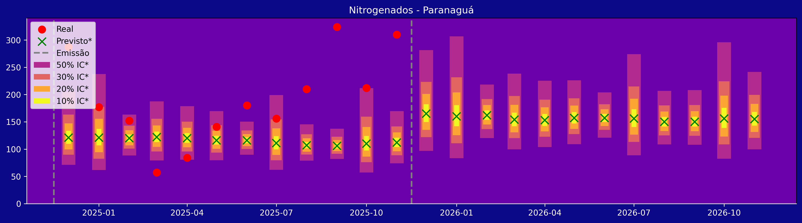
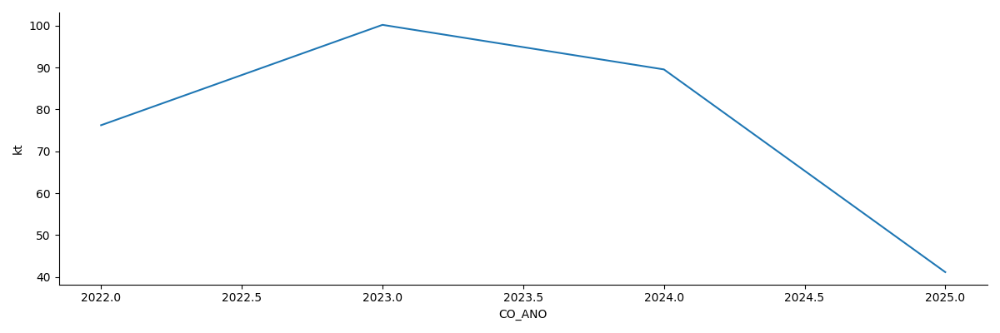

#  QuantImport  

**[Home](https://quantimportbrazil.github.io/Sobre/)** | **[Voltar para Demos](https://quantimportbrazil.github.io/Demo/)**

---

# Fator mais Importante - Exemplo

> **Emissão:** 12 / 2025  

---

**[Home](https://quantimportbrazil.github.io/Sobre/)**  

O aprendizado de máquina (ML) não só emite as previsões, mas também nos permite ranquear a importância dos fatores que as afetam.

Para demonstrar essa capacidade, selecionamos a previsão que apresentou a maior variação em relação ao ano anterior:

* Produto Nitrogenados — Município de Paranaguá-PR — de 09/2025 para 09/2026.

Essa **variação mais significativa** pode ser observada no gráfico a seguir:

Nas referidas datas, note que:  
* A previsão feita em Dez/24 para desembarque em Setembro/25 foi de 110 kt de Nitrogenados em Paranaguá  
* A previsão feita agora, em Dez/25 para desembarque em Set/26 foi de 156 kt de Nitrogenados em Paranaguá  
* Aumento de **46kt**, crescimento **acima de 40%** de um para o ano seguinte  

> O fator mais importante apontado pelo **Machine Learning** para essa grande variação:
> A **queda acentuada na importação** do **mesmo grupo de produtos no Estado de SP em Set/2025**, como se pode ver no gráfico a seguir:

#### Importação:
  
  
---

## Contato
**André Coutinho Bueno**  
Cientista de Dados e Fundador  
[andre.bueno@quantimport.com.br](mailto:andre.bueno@quantimport.com.br)
